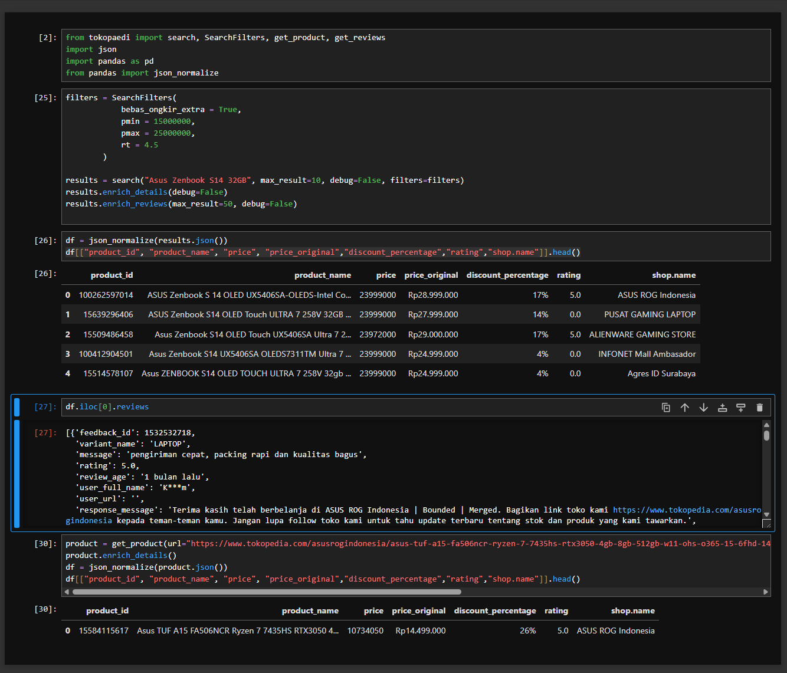

# Tokopaedi - Python Library for Tokopedia E-Commerce Data Extraction
 [](https://pepy.tech/projects/tokopaedi)  [](https://github.com/hilmiazizi/tokopaedi/blob/main/LICENSE) 

**Extract product data, reviews, and search results from Tokopedia with ease.**

Tokopaedi is a powerful Python library designed for scraping e-commerce data from Tokopedia, including product searches, detailed product information, and customer reviews. Ideal for developers, data analysts, and businesses looking to analyze Tokopedia's marketplace.


## Features
- **Product Search**: Search Tokopedia products by keyword with customizable filters (price, rating, condition, etc.).
- **Detailed Product Data**: Retrieve rich product details, including variants, pricing, stock, and media.
- **Customer Reviews**: Scrape product reviews with ratings, timestamps, and more.
- **Serializable Results**: Dataclass-based results with `.json()` for easy export to JSON or pandas DataFrames.
- **SearchResults Container**: Iterable and serializable container for streamlined data handling.


## Installation
Tokopaedi is available on PyPi: [https://pypi.org/project/tokopaedi/](https://pypi.org/project/tokopaedi/)

Install Tokopaedi via pip:

```bash
pip install tokopaedi
```

##  Quick Start
```python
from tokopaedi import search, SearchFilters, get_product, get_reviews, combine_data
from dataclasses import dataclass, asdict
import json

filters = SearchFilters(
            bebas_ongkir_extra = True,
            pmin = 15000000,
            pmax = 30000000,
            rt = 4.5
        )

results = search("Zenbook 14 32GB", max_result=100, debug=False)
for result in results:
    combine_data(
        result,
        get_product(product_id=result.product_id, debug=True),
        get_reviews(product_id=result.product_id, max_result=20, debug=True)
    )

with open('log.json','w') as f:
    f.write(json.dumps(results.json(), indent=4))
print(json.dumps(results.json(), indent=4))
```

## 📘 API Overview

### 🔍 `search(keyword: str, max_result: int = 100, filters: Optional[SearchFilters] = None, debug: bool = False) -> SearchResults`

Search for products from Tokopedia.

**Parameters:**

-   `keyword`: string keyword (e.g., `"logitech mouse"`).
    
-   `max_result`: Expected number of results to return.
    
-   `filters`: Optional `SearchFilters` instance to narrow search results.
    
-   `debug`: Show debug message if True
    

**Returns:**

-   A `SearchResults` instance (list-like object of `ProductSearchResult`), supporting `.json()` for easy export.
    

----------

### 📦 `get_product(product_id: Optional[Union[int, str]] = None, url: Optional[str] = None, debug: bool = False) -> ProductData`

Fetch detailed information for a given Tokopedia product.

**Parameters:**

- `product_id`: (Optional) The product ID returned from `search()`. If provided, this will take precedence over `url`.
- `url`: (Optional) The full product URL. Used only if `product_id` is not provided.
- `debug`: If `True`, prints debug output for troubleshooting.

> ⚠️ Either `product_id` or `url` must be provided. If both are given, `product_id` is used and `url` is ignored.

**Returns:**

- A `ProductData` instance containing detailed information such as product name, pricing, variants, media, stock, rating, etc.
- Supports `.json()` for easy serialization (e.g., to use with `pandas` or export as `.json`).

----------

### 🗣️ `get_reviews(product_id: Optional[Union[int, str]] = None, url: Optional[str] = None, max_count: int = 20, debug: bool = False) -> List[ProductReview]`

Scrape customer reviews for a given product.

**Parameters:**

- `product_id`: (Optional) The product ID to fetch reviews for. Takes precedence over `url` if both are provided.
- `url`: (Optional) Full product URL. Used only if `product_id` is not provided.
- `max_count`: Maximum number of reviews to fetch (default: 20).
- `debug`: Show debug messages if `True`.

> ⚠️ Either `product_id` or `url` must be provided.

**Returns:**

- A list of `ProductReview` objects.
- Each object supports `.json()` for serialization (e.g., for use with `pandas` or JSON export).

----------

### 🔗 `combine_data(search_results, products=None, reviews=None) -> SearchResults`

Attach product detail and/or reviews to the search results.

**Parameters:**

-   `search_results`: The `SearchResults` from `search()`.
    
-   `products`: List of `ProductData` from `get_product()` (optional).
    
-   `reviews`: List of `ProductReview` from `get_reviews()` (optional).
    

**Returns:**

-   A new `SearchResults` object with `.product_detail` and `.product_reviews` fields filled in (if data was provided).
    

----------
##  `SearchFilters` – Optional Search Filters

Use `SearchFilters` to refine your search results. All fields are optional. Pass it into the `search()` function via the `filters` argument.

#### Example:
```python
from tokopaedi import SearchFilters, search

filters = SearchFilters(
    pmin=100000,
    pmax=1000000,
    condition=1,              # 1 = New
    is_discount=True,
    bebas_ongkir_extra=True,
    rt=4.5,                   # Minimum rating 4.5
    latest_product=30         # Products listed in the last 30 days
)

results = search("logitech mouse", filters=filters)
```

#### Available Fields:

| Field                 | Type     | Description                                       | Accepted Values                  |
|----------------------|----------|---------------------------------------------------|----------------------------------|
| `pmin`               | `int`    | Minimum price (in IDR)                            | e.g., `100000`                   |
| `pmax`               | `int`    | Maximum price (in IDR)                            | e.g., `1000000`                  |
| `condition`          | `int`    | Product condition                                 | `1` = New, `2` = Used            |
| `shop_tier`          | `int`    | Type of shop                                      | `2` = Mall, `3` = Power Shop     |
| `rt`                 | `float`  | Minimum rating                                    | e.g., `4.5`                      |
| `latest_product`     | `int`    | Product recency filter                            | `7`, `30`, `90`               |
| `bebas_ongkir_extra` | `bool`   | Filter for extra free shipping                   | `True` / `False`                 |
| `is_discount`        | `bool`   | Only show discounted products                    | `True` / `False`                 |
| `is_fulfillment`     | `bool`   | Only Fulfilled by Tokopedia                      | `True` / `False`                 |
| `is_plus`            | `bool`   | Only Tokopedia PLUS sellers                      | `True` / `False`                 |
| `cod`                | `bool`   | Cash on delivery available                        | `True` / `False`                 |


---

## Example: Enrich with product details & reviews, then convert to pandas DataFrame from Jupyter Notebook

```python
from tokopaedi import search, SearchFilters, get_product, get_reviews, combine_data
import json
import pandas as pd
from pandas import json_normalize

filters = SearchFilters(
    bebas_ongkir_extra=True,
    pmax=100000,
    rt=4.5
)

# Fetch search results
results = search("logitech g304", max_result=10, debug=False)

# Enrich each result with product details and reviews
for result in results:
    combine_data(
        result,
        get_product(product_id=result.product_id, debug=False),
        get_reviews(product_id=result.product_id, max_result=1, debug=False)
    )

# Convert to DataFrame and preview important fields
df = json_normalize(results.json())
print(df[[
    "product_id",
    "category",
    "real_price",
    "original_price",
    "product_detail.product_name",
    "rating",
    "shop.name"
]].head())
```




## Author

Tokopaedi was created by **Hilmi Azizi**. For inquiries, feedback, or collaboration, contact me at [root@hilmiazizi.com](mailto:root@hilmiazizi.com). You can also reach out via [GitHub Issues](https://github.com/hilmiazizi/tokopaedi/issues) for bug reports or feature suggestions.

## 📄 License

This project is licensed under the MIT License.

You are free to use, modify, and distribute this project with attribution. See the [LICENSE](https://github.com/hilmiazizi/tokopaedi/blob/main/LICENSE) file for more details.


<!-- Google Search Console Verification -->
<meta name="google-site-verification" content="Apib7-x98H0j5cPqHWwSMm6dNU4GmODRoqxLiDzdx9I" />
